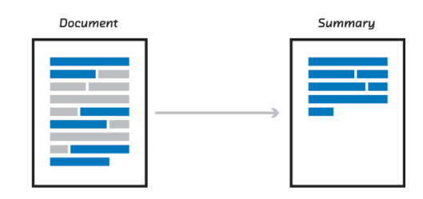

# COVID19: A Novel Automatic Biomedical Document Summarisation Using Disease Specific Text Corpora

## Abstract 

This research work firstly proposes a method for automatically generating
multiple disease-specific text corpora by referring appropriate biomedical research articles.
These disease-specific text corpuses updated whenever new research articles of appropriate
kinds are added to the database. Secondly, query-based disease-specific text corpora are
included as a dictionary to identify the relevant documents to enhance the performance of text
summarization. The proposed approach is validated on COVID-19 disease-related research
articles and contains four phases. The first phase employs the SciSpacy model to extract the
biological entities. The second phase utilizes Yake unsupervised algorithm to extract the
coVID-19 related keywords. The third phase removes the common key phrases generated
from the above two phrases. The fourth phase feeds the keywords generated from the first
and second phases as input to modify the text rank algorithm where the user-defined
keywords will be assigned as a higher node compared to other keyword nodes to increase the
accuracy level of summarisation. The proposed method outperforms the other summarisation
approaches and showcases a Rouge score of P: 58.93 R: 62.26 FI1:60.56.

#### Python Packages used in this Repository
- Numpy 
- pandas
- NLTK

## Initial Development  
**TextRank**
- The main objective is to utilize the text rank algorithm at a full extent to achieve more accuracy on ontology-based summarization. It is the core backbone of the repo where the algorithm was built on.

**YAKE Keyword Extraction**
- YAKE algorithm was used here to achieve more keyword extraction with unsupervised keyword extraction which has more bias towards the ontology-based keywords. The keywords fed into the TextRank nodes to get more accuracy on summarization.

## Accuracy Report
Evaluation with Avg

	rouge-1:	P: 58.93	R: 62.26	F1: 60.55
	rouge-2:	P: 45.95	R: 48.57	F1: 47.22
	rouge-3:	P: 44.55	R: 47.12	F1: 45.79
	rouge-4:	P: 44.04	R: 46.60	F1: 45.28
	rouge-l:	P: 57.79	R: 60.50	F1: 59.11
	rouge-w:	P: 49.55	R: 20.60	F1: 29.10